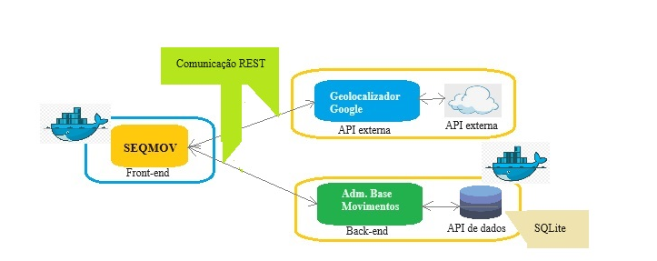

# Minha API

Este é um projeto que faz parte dos requisitos para  aprovação na disciplina **Desenvolvimento Back-end Avançado**. 

O objetivo da aplicação é a divulgação de exercícios físicos.
O acesso aos exercícios poderá ser feito sem necessidade do usuário se cadastrar, esperando-se que a renda venha de anúncios, como acontece nos joguinhos.
Mais tarde será permitido ao usuário se cadastrar para, eventualmente, sugerir novos movimentos que serão avaliados para possível inclusão no banco de dados da aplicação, tornando o uso do aplicativo mais atrativo.
O usuário poderá selecionar um subconjunto dos movimentos disponíveis para compor uma série de exercícios para seu uso. Futuramente, o aplicativo auxiliará o usuário na edição de suas séries de exercícios. 

Entretanto, este MVP assume que o usuário é o administrador e poderá, além de consultar, incluir e excluir movimentos, para cumprir os requisitos desta sprint.



---
## Como instalar e executar a API


Será necessário ter todas as libs python listadas no `requirements.txt` instaladas.
Após clonar o repositório, é necessário ir ao diretório raiz, pelo terminal, para poder executar os comandos descritos abaixo.

> É fortemente indicado o uso de ambientes virtuais do tipo [virtualenv](https://virtualenv.pypa.io/en/latest/installation.html).

```
(env)$ pip install -r requirements.txt
```

Este comando instala as dependências/bibliotecas, descritas no arquivo `requirements.txt`.

Para executar a API  basta executar:

```
(env)$ flask run --host 0.0.0.0 --port 5000
```

Em modo de desenvolvimento é recomendado executar utilizando o parâmetro reload, que reiniciará o servidor
automaticamente após uma mudança no código fonte. 

```
(env)$ flask run --host 0.0.0.0 --port 5000 --reload
```

Abra o [http://localhost:5000/#/](http://localhost:5000/#/) no navegador para verificar o status da API em execução.

## Como executar através do Docker

Certifique-se de ter o Docker instalado e em execução na sua máquina
Navegue até o diretório que contém o Dockerfile e o requirements.txt no terminal. Execute, como administrador, o seguinte comando para construir a imagem Docker:

$ docker build -t mtmapi .

Uma vez criada a imagem, para executar o conteiner basta executar, como administrador, o seguinte comando:

$ docker run -p 5000:5000 mtmapi

Uma vez executando, para acessar a api, basta abrir o http://localhost:5000/#/ no navegador.

Alguns comandos úteis:

Para verificar se a imagem foi criada você pode executar o seguinte comando:

$ docker images
